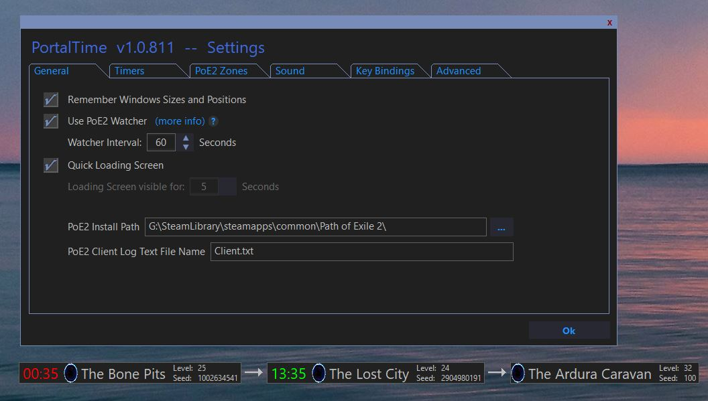
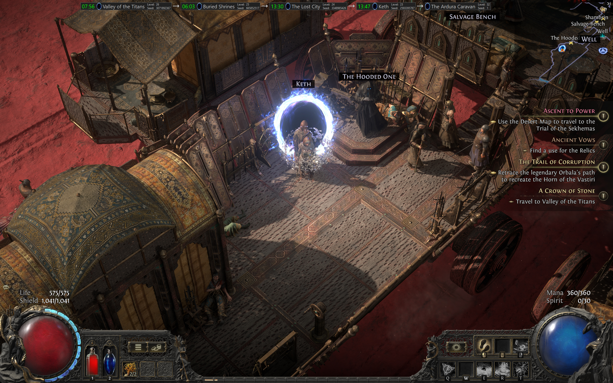
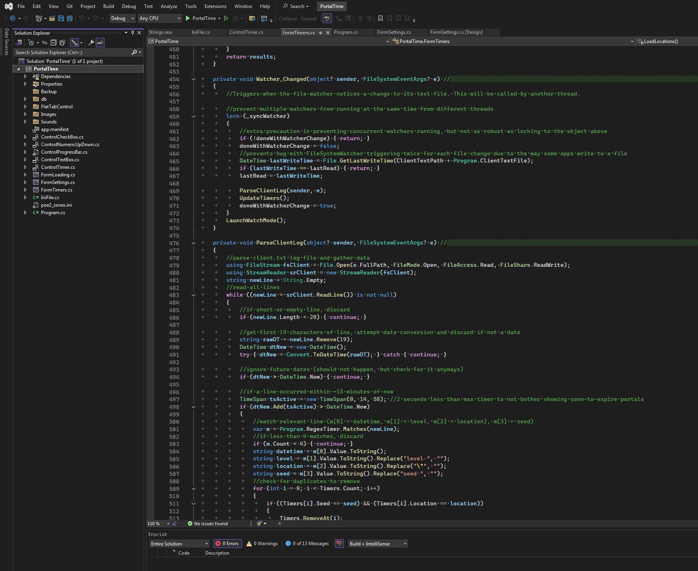
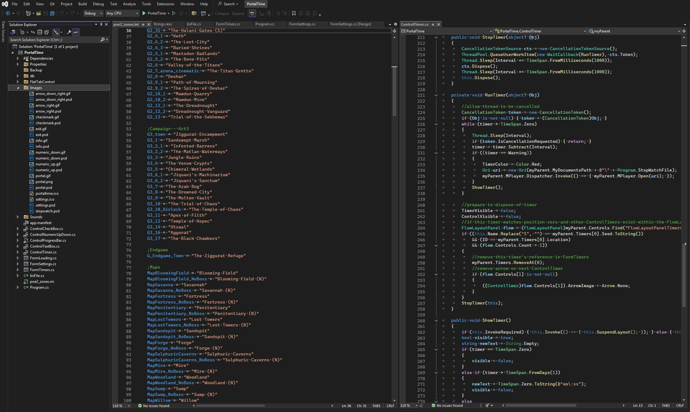

# PortalTime

 
<h2>Track portal and zone expiration times in Path of Exile 2</h2>

Path of Exile 2 is a game developed by Grinding Gear Games: https://pathofexile2.com

This is a fan-made app to monitor PoE2's log file (Client.txt) to gather datetime on all zones you've visited and display timers for all zones with an opne instance for your character. If doesn't do anything with the game client, as it only reads and parses the log file it creates on your local drive. This is a file you can open and view at your leisure, so all this app does is present that information in a visual and more useful method.

I'm approaching the end of my devleopment and expect to release this on GitHub in either February or March of 2025. The core functionality of it is working well (see screen caps below), so it's all about adding the polish right now.

To-Do:
* Fleshing out the rest of the user settings, including timer styling and PoE2 locations file editing
* Currently uses FileSystemWatcher, but adding option for interval checking and manually-triggered checking as well
* Get global key bindings working

Future Versions:
* Provide an option to use SharpDX (an old tool) or Windows SDK to create a DirectX overlay for those who play PoE2 on only one display in full screen mode. Currrently PortalTime works either on another monitor or over top of PoE2 in Window or Windowed Fullscreen mode.

MIT license, C#, Windows, built with Visual Studio 2022.

